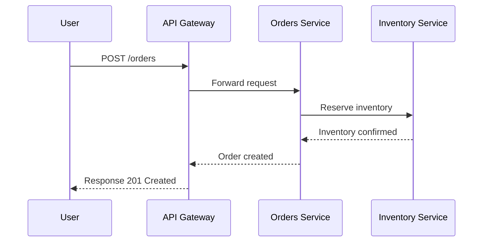

# Orders Service Documentation  

## 1. Overview  
- **Functional Overview**: Manages customer orders including creation, update, cancellation, and retrieval.  
- **Technical Overview**: Implemented in Node.js (Express), MongoDB for persistence, RabbitMQ for async messaging.  

## 2. Architecture & Design  
- Component diagram: (Mermaid diagram can be added here)  
- Deployment: Runs as Docker container, deployed via Kubernetes with autoscaling enabled.  

## 3. API Documentation  
- **POST /orders** – Create a new order  
- **GET /orders/{id}** – Retrieve order details  
- **PATCH /orders/{id}** – Update order status  
- **DELETE /orders/{id}** – Cancel an order  
- Authentication: JWT-based authentication, role-based authorization  
- Versioning: v1 APIs, v2 in planning  

## 4. Database & Data Models  
- MongoDB collections: `orders`, `order_items`  
- Schema: Order → OrderItems (1:N relationship)  

## 5. Sequence Diagrams  

## 6. Dependencies  
- **Internal**: Inventory Service, Payment Service  
- **External**: RabbitMQ for async order events  

## 7. Configuration & Environment  
- `DB_URI` – MongoDB connection string  
- `RABBITMQ_URI` – Queue service connection  
- `JWT_SECRET` – Secret for auth  

## 8. Error Handling & Retry Strategy  
- Returns standard error codes (400, 404, 500)  
- Retries failed queue messages with exponential backoff  

## 9. Testing  
- Unit tests: 82% coverage (Mocha + Chai)  
- Integration tests: API contract tests via Postman/Newman  
- E2E: Order flow tested in staging  

## 10. Performance & Scaling Notes  
- Handles up to 1k orders/minute under load testing  
- Scales horizontally via Kubernetes HPA  

## 11. Development Setup  
- Prerequisites: Node.js 18, MongoDB 6, Docker  
- Local run: `docker-compose up`  
- Debug: Run with `npm run dev` and attach debugger on port 9229  

## 12. Deployment & Operations  
- CI/CD via GitHub Actions → Docker Hub → Kubernetes  
- Rollbacks supported via Helm chart versioning  
- Monitoring with Prometheus + Grafana dashboards  

## 13. Security  
- JWT authentication, RBAC authorization  
- Secrets stored in Vault  
- TLS for all service-to-service calls  

## 14. Known Issues / TODOs  
- Improve performance of order search queries  
- Implement circuit breaker for Payment Service dependency  

## 15. Changelog  
- v1.0.0 – Initial release  
- v1.1.0 – Added cancellation API  
- v1.2.0 – Added RabbitMQ integration  

## 16. Ownership & Contacts  
- Team: Order Management Squad  
- Slack: #orders-service-support  
- On-call: PagerDuty rotation  
