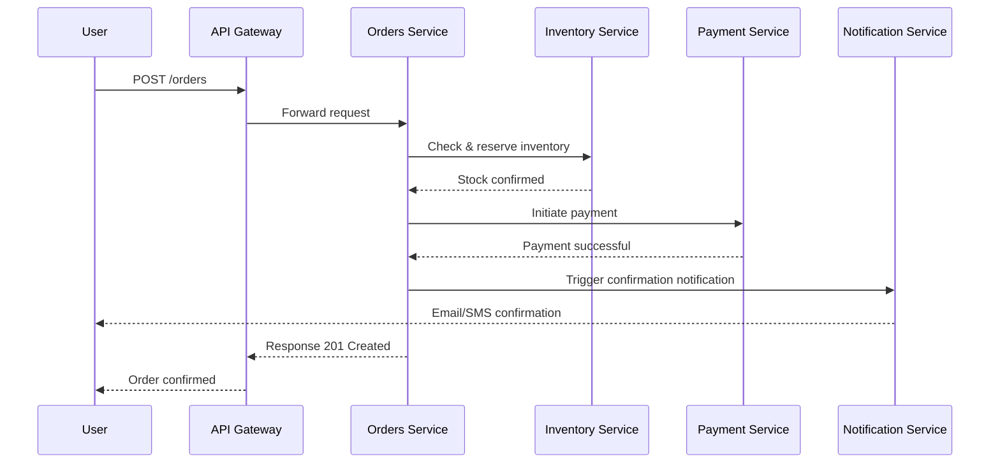
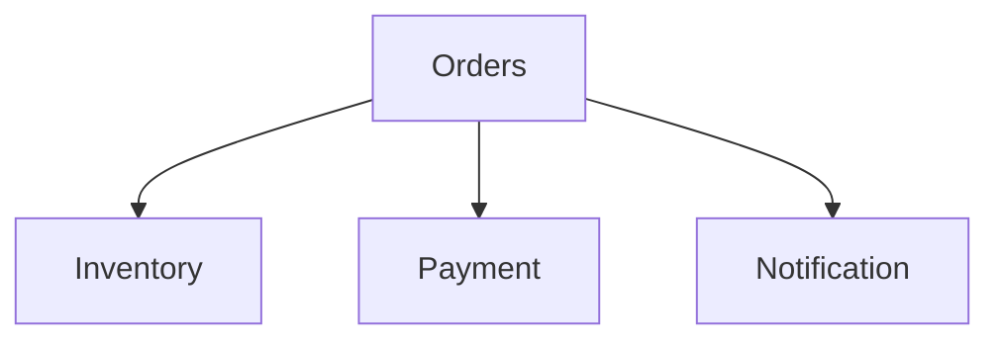

# System Documentation  

## 1. End-to-End Overview  
This system simulates an **e-commerce platform** with 4 microservices:  
- **Orders Service**: Handles customer orders  
- **Inventory Service**: Manages stock levels  
- **Payment Service**: Processes payments  
- **Notification Service**: Sends email/SMS notifications  

### High-level Flow  
1. User places an order.  
2. Order Service validates request and reserves inventory.  
3. Payment Service processes payment.  
4. Notification Service sends confirmation to the customer.  

System is deployed on Kubernetes with service discovery via API Gateway.  

## 2. Sequence Diagrams  

## 3. Service Dependency Graph  

## 4. Data Contracts & Schemas  
- Shared JSON schema for `OrderCreated` event (published to RabbitMQ).  
- Payment events use Avro schema with versioning.  

## 5. Deployment & Infrastructure  
- **Cloud**: AWS (EKS for Kubernetes, RDS for DB, S3 for storage)  
- **CI/CD**: GitHub Actions → Docker Hub → ArgoCD  
- **Deployment Strategy**: Rolling deployments with HPA scaling  

## 6. Security & Compliance  
- JWT authentication across services via API Gateway  
- Secrets stored in HashiCorp Vault  
- PCI-DSS compliance for payment processing  
- Audit logs stored in S3 for 90 days  

## 7. Observability  
- Logs aggregated via ELK stack  
- Metrics collected with Prometheus, visualized in Grafana  
- Distributed tracing with Jaeger (OpenTelemetry instrumentation)  

## 8. Non-Functional Requirements  
- Scalability: 10k orders/hour sustained load  
- Latency: <200ms average API response time  
- Availability: 99.95% SLA  
- DR: Multi-region failover, RPO = 15 mins, RTO = 30 mins  

## 9. Operational Runbook  
- **Incident Triage**: First check service logs via Kibana.  
- **Common Failures**: Payment gateway timeouts → auto-retry configured.  
- **Escalation**: Notify on-call engineer via PagerDuty.  

## 10. Glossary & Service Map  
- **Order**: Customer purchase request  
- **Inventory**: Stock availability info  
- **Payment**: Processing of financial transactions  
- **Notification**: User communication channel  

Service Ownership Matrix:  
- Orders → Orders Squad  
- Inventory → Inventory Squad  
- Payment → Payments Squad  
- Notification → Comms Squad  

## 11. Cost & Resource Considerations  
- Payment Service incurs higher infra costs due to PCI compliance (dedicated DB, isolated network).  
- Optimization: Enable reserved instances for RDS, auto-scaling policies for Orders Service.  

## 12. Release & Versioning Strategy  
- Bi-weekly release cadence per service.  
- APIs versioned with `/v1`, `/v2` paths.  
- Backward compatibility tested in contract tests.  

## 13. Roadmap  
- Add Recommendation Service for cross-sell/upsell.  
- Migrate Notifications to EventBridge.  
- Introduce service mesh (Istio) for zero-trust security.  
